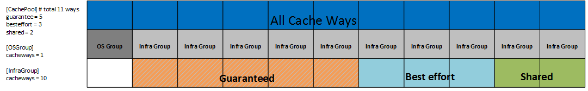

# RMD Configure Guide:

This guide shows how to configure RMD.

## configuration file search order

The configuration file directory search is `/etc/rmd`

Besides, user can specify configuration file directory by provide --conf-dir option
to RMD binary.

## configuration files

Belows are the configuration files for RMD:

* rmd.toml : main configuration file
* cpu_map.toml : CPU microarchitecture for RMD to discover hardware platform
* policy.yaml : pre-defined policies for different hardware platforms
* acl/ : contains ACL setting for RMD
* cert/ : certifications for RMD if TLS is enabled
* pam/ : unix PAM data base

There are some sample configuration files could be found [here](../etc/rmd).

## rmd.toml

### [default] section
* address: RMD API server listen address.
* policypath: pre-defined policy file path.
* tlsport: https listen port, it should be higher then 1024.
* certpath: support pem format, hard code that CAFile is ca.pem, CertFile is rmd-cert.pem, KeyFile is rmd-key.pem.
* clientcapath: support pem format, hard code that CAFile is ca.pem.
* clientauth: TLS client authentication level, supported "no, require, require_any, challenge_given, challenge".
* unixsock: unix socket path, default unix socket is not enabled.
* sysresctrl: path to *resctrl* filesystem mount point (usualy /sys/fs/resctrl")
* plugins: string containing comma separated list of loadable modules (RMD plugins), see [moduleX](#modulex-section) for details
* dbValidatorInterval: Interval between workload database validation in seconds, by default it's 30s. Validator is used to periodically check db
and remove all workloads related to system processes if all those processes doesn't exist anymore (so such workload will stay in db if at least one process still exists). Validator doesn't have impact on workloads related to CPU cores only.

### [rdt] section
* mbaMode: MBA (Memory Bandwidth Allocation) mode of operation supported by RMD, possible options are: "none", "percentage" and "mbps"

### [debug] section
* enabled: true to enable debug mode, will listen as http protocol, only for testing.
* debugport: when enabled=ture, http protocal will listen on this.

### [log] section
* path: where the log file output.
* env: used for log format. It can be "production" or "env". "production" means JSON format. "dev" means text format.
* level: log message level.
* stdout: log the message out to stand output or not.

*Don't support log to stdout and file simultaneously*

### [database] section
* backend: which database backend want to use, currently rmd support only bolt db.
* transport: for bolt db, it's a file path;
* dbname: what database name rmd will use.


### [OSGroup] section
* cacheways: cache way number reserved for operating system
* cpuset: used to define how many cache ways this OS group will take

### [InfraGroup] section
* cacheways: cache way number reserved for infrastructure group
* cpuset: used to define how many cache ways this infrastructure group will take
* tasks: Infra group is optional, it is used to configure the cache allocation and cpu set for some specific processes. Set the specific processes task list by "tasks" option, the task item can be wildcards. RMD does not support exclusive task item at present, such as "^ovs-db". This group will take effect once RMD start up. This group can be overlap with other cache pools.

### [CachePool] section
`CachePool` section defines how RMD organize it cache way layout, it basically support 3 cache pools, `shared`, `besteffort`, `guarantee`. For different requrest of a workload, it will be placed in different cache pool, see [user guide](UserGuide.md).

* shared: shared cache pool cache way number
* max_allowed_shared: allowed workload number in shared cache pool
* besteffort: best effort cache pool cache way number
* shrink: whether to shrink cache ways in best effort pool if cache ways are in short supply.
* guarantee: guarantee cache pool cache way number



*There's hardware limitation on a host to create resource group, so the workload we can created are limitated too. OSGroup, InfraGroup and shared group will consume one resource group*

### [acl] section

RMD depends on authorization library [casbin](https://github.com/casbin/casbin) to implement ACL(ACL (Access Control List).

* path: acl configuration file directory, in this directoy, it should contain a policy file and a model file for a acl.
* filter: only support url as acl filter for now.
* authorization: authorize the client, can identify client by signature, role(OU) or username(CN). Default value is signature. If value is signature, admincert     and usercert should be set.
* admincert: A cert is used to describe user info. These cert files in this path are used to define the users that are admin. Only pem format file at present. The files can be updated dynamically
* usercert: A cert is used to describe user info. These cert files in this path are used to define the user with low privilege. Only pem format file at present. The files can be updated dynamically

### [pam] section
This section will be used if `clientauth` is not set to `no`
* service: the name of pam service

### [pluginX] section

RMD supports loadable modules (RMD plugins) that allows to easily extend RMD functionality. To use RMD plugin two steps are needed:

* add *plugin_name* to the list defined as *plugins* parameter in *default* section
* add configuration section for this plugin with the same name as *plugin_name*

Example:

```toml
[default]
# ...
# standard RMD configuration
# ...
plugins = "plugin1,plugin2"

[plugin1]
path = "/path/to/compiled/plugin1.so"
# plugin-specific params in format: name = value
param1 = value1


[plugin2]
path = "/path/to/compiled/plugin2.so"
# ... other plugin-specific params in format: name = value
param1 = value1
param2 = "string value"
```

For each configured plugin at least *path* parameter with a path to plugin's .so file is needed. Other plugin specific parameters (ex. address/port of some service, path to resource file) should be added according to plugin documentation.

Please note that plugin name should match the name used in workload REST requests.

## policy.toml/policy.yaml
This file contains policies for Cache plugin (catpolicy) and optional P-State plugin (pstatepolicy). Policies are pre-defined sets of paramters for different levels of service (different tiers). Currently 3 tiers are supported: `gold`, `silver` and `bronze`.

Policy (tier) can be selected during workload creation. If 'policy' given in workload description during creation (POST) or update (PATCH) request then manualy specified parameters
are ignored.

Policy file path is configured in `rmd.toml` default section as `policypath` option. RMD currently supports yaml, toml as a policy file format.

## cpu_map.toml

cpu_map.toml defines what's the platform is when RMD try to discover this host, for each platform CPU, requires the family number and model number.

## acl

Defined acl policy and model, also certifications of users and admin.

## cert

Certifications used when TLS is enabled for, please refer the [sample](../etc/rmd/cert) for what certifacations are required.

## pam

Pam configuration file directory
